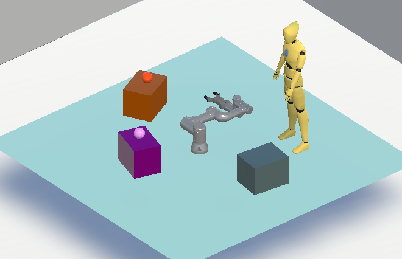

## Comfort-RL (Robotic-learnig)

Discover Comfort Robotic-Learning, an environment for developing robotic agents that take human comfort into account via reinforcement learning environment, built with Unity for high-quality visuals and smooth integration with other RL libraries. **Coming soon. October 2024**

The environment is built in Unity, using the ML-Agents Toolkit for training intelligent agents with deep learning. Learn more at [ML-Agents Toolkit](https://github.com/Unity-Technologies/ml-agents).

## Realease Version Notes
The release version will feature various robotic environments generated through executable files, allowing easy and direct training with extensive customization. These environments support training agents with ML-Agents and other machine learning libraries.

