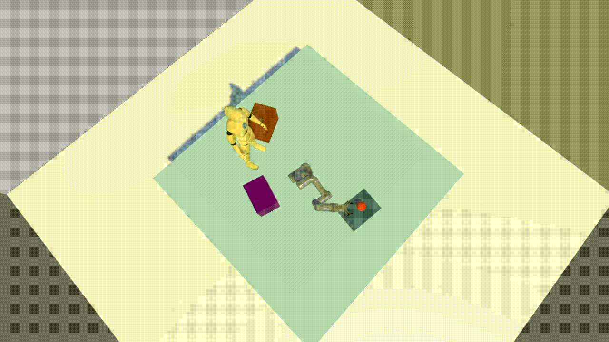

## Comfort-RL (Robotic-learnig)

Discover Comfort Robotic-Learning, an environment for developing robotic agents that take human comfort into account via reinforcement learning environment, built with Unity for high-quality visuals and smooth integration with other RL libraries. **Full Release Source Code and PreRelease executable NOW available**

The environment is built in Unity, using the ML-Agents Toolkit for training intelligent agents with deep learning. Learn more at [ML-Agents Toolkit](https://github.com/Unity-Technologies/ml-agents).

## First Release Version Notes

- The full Unity working source code is provided, allowing users to make changes, adjustments, and retrain agents as needed. Code is not fully cleaned and not fully commented. Expect a better coding and comments during first months of 2025,
- 
- The current PreRelease executable version provides a preview of the environment and its capabilities (.exe). It may contain minor issues during training, but it serves as an early access for users to explore and provide feedback. 

- The PreRelease and Source code version  also include several environments with different configurations. Some versions may be missing configuration files or folders to simplify testing in specific scenarios.

## Next Realease Version Notes
The upcoming release version will feature various robotic environments generated through executable files, allowing easy and direct training with extensive customization. These environments support training agents with ML-Agents and other machine learning libraries. The first release around **Mid 2025** will include the following features:
- Executable environment files for testing and training algorithms
- Comprehensive explanation of the configuration, personalization, and training parameters
- Multiple environments for testing (simple tasks and complex tasks!) - Already available via source code. ** Soon arriving more complex and visual setups **
- Comfort function available for agents to act according to the user's comfort level (In depth explanation on [paper](https://ieeexplore.ieee.org/document/10658649))
- Interactive environment for users to test the trained agents (VR) 

