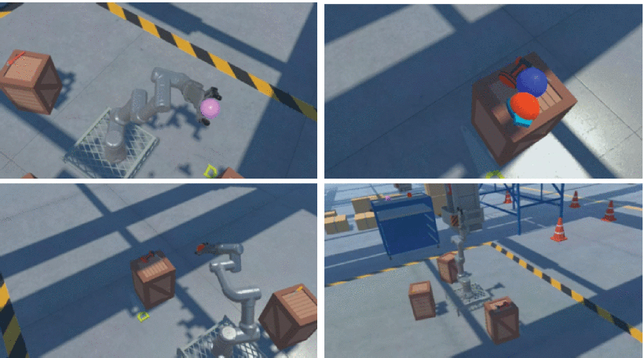

# 🕶️ Comfort-RL VR Testing Environment

This folder contains the **VR scene** of the Comfort-RL project. It allows you to **load and test trained agents** in a fully immersive environment using Unity and ML-Agents.

---

## 🎯 Purpose

This VR setup is designed to:

- Test **comfort-aware agents** trained via reinforcement learning in a virtual reality setting
- Allow intuitive inspection of robot behaviors from a first-person perspective
- Evaluate trained `.nn` policies in a realistic, immersive scenario

---

## 📂 Contents

- ✅ A working **Unity VR scene** using OpenXR (Oculus / SteamVR compatible)
- ✅ Basic interaction and teleportation mechanics for movement and observation
- ✅ Preconfigured settings aligned with the Comfort-RL training environment

---

## 🛠 Development Status

- ⚠️ **Code cleaning is in progress**: expect updates in variable names, folder organization, and comments.
- 🔧 Requires Unity 2021.3+, ML-Agents Toolkit, and OpenXR plugin
- 🧪 Tested with trained SAC and PPO models from the main Comfort-RL setup

---

## 🚀 How to Use

1. Open this Unity scene with Unity 2021.3+.
2. Add your trained `.nn` file to the project (you can place it anywhere inside `Assets/`)
3. In the Unity Editor, select the CobotAgent GameObject. (4 available in the scene for testing different nn at the same time) 
4. Assign your `.nn` file in the **Behavior Parameters** component.
5. Enter Play mode with your VR headset connected.
6. Observe and interact with the robot to evaluate comfort-based behaviors.

---

## 📬 Feedback

Issues, suggestions, or improvements are welcome via the main repo:  
🔗 [github.com/AsierGonz/Comfort-RL](https://github.com/AsierGonz/Comfort-RL)
